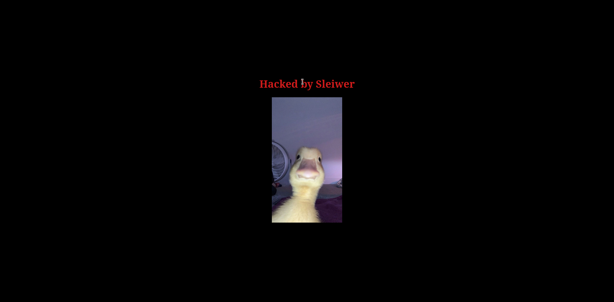

# HackedWEB

Bem-vindo ao meu GitHub! 🚀
Aqui, você vai encontrar diversos projetos e contribuições, com foco em segurança cibernética e técnicas de hacking ético. 🔐

Através do meu trabalho com **Deface** e outras atividades relacionadas, procuro entender e aprimorar as defesas de sites e sistemas, sempre com a intenção de **fortalecer a segurança online**.

🔍 Meus projetos incluem:
    ▪️ Scripts e ferramentas para teste de vulnerabilidades
    ▪️ Exploração de falhas de segurança com o objetivo de proteção
    ▪️ Desafios e demonstrações de hacking ético

Se você compartilha do interesse por segurança da web, hacking ético, ou se quer aprender a proteger sistemas contra ataques, você está no lugar certo!

